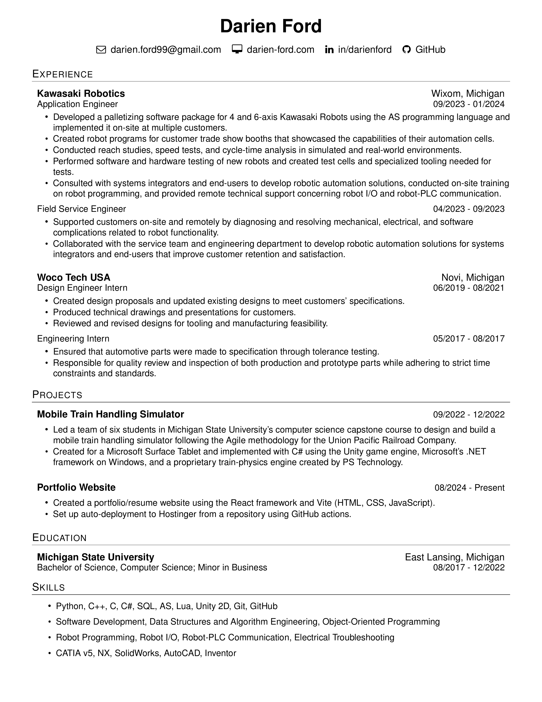

# Hello 👋, I'm Darien

I'm a computer science graduate from Michigan State University who is motivated by new technologies and interested in solving complex problems. I have recently worked as an application engineer at Kawasaki Robotics, where I consulted with systems integrators and end-users to create automation solutions for different general industry applications using Kawasaki robots.

---

### 🧰 My Languages and Tools

 

#

### 📄 My Resume

<!--
**Darien-Ford/Darien-Ford** is a ✨ _special_ ✨ repository because its `README.md` (this file) appears on your GitHub profile.

Here are some ideas to get you started:

- 🔭 I’m currently working on ...
- 🌱 I’m currently learning ...
- 👯 I’m looking to collaborate on ...
- 🤔 I’m looking for help with ...
- 💬 Ask me about ...
- 📫 How to reach me: ...
- 😄 Pronouns: ...
- ⚡ Fun fact: ...
-->
